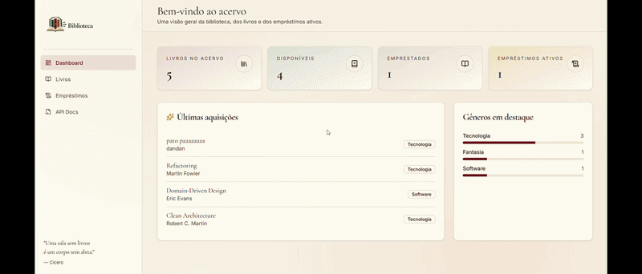
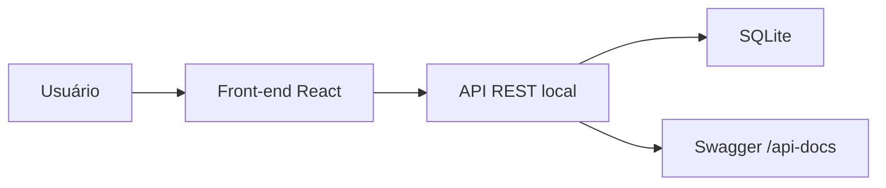

<h1 align="center">
  
  <br>
  <p>
    
    
    
  </p>
</h1>

**Gerenciamento de Biblioteca** é o **front-end** de um projeto **fullstack** para controle de acervo e empréstimos. Esta aplicação web foi desenvolvida com **React 19**, **TypeScript**, **Vite** e **TanStack Start/Router**, e consome uma API REST própria que roda localmente.

O front-end organiza a interface em uma arquitetura inspirada em MVVM, enquanto a API é responsável pelas regras de negócio, persistência em SQLite, rotas REST e documentação Swagger.

---

## Visualização do Projeto

<p align="center">
  
</p>

---

## Projeto Fullstack

Este repositório faz parte de um sistema dividido em duas aplicações:

| Camada | Repositório | Responsabilidade |
|--------|-------------|------------------|
| **Front-end** | [gerenciamento-biblioteca-front-end](https://github.com/DanielVerissimo1/gerenciamento-biblioteca-front-end) | Interface web para dashboard, livros, empréstimos e devoluções |
| **Back-end / API** | [gerenciamneto-biblioteca-api](https://github.com/DanielVerissimo1/gerenciamneto-biblioteca-api) | API REST com Node.js, Express, TypeScript, SQLite, Knex, Zod e Swagger |

O fluxo entre os projetos funciona assim:



Para usar o sistema completo, a API deve estar em execução localmente em `http://localhost:3000`, que é a URL configurada no front-end.

---

## Funcionalidades

| Funcionalidade | Descrição |
|----------------|-----------|
| **Dashboard** | Exibe indicadores do acervo, livros disponíveis, livros emprestados e empréstimos ativos |
| **Últimas aquisições** | Lista os livros cadastrados mais recentemente |
| **Gêneros em destaque** | Mostra os gêneros mais frequentes do acervo com barra de proporção |
| **Listagem de livros** | Visualize o acervo em cards com título, autor, gênero e status de disponibilidade |
| **Busca local** | Pesquise livros por título, autor ou gênero diretamente na tela |
| **Filtro por gênero** | Filtre livros por gênero usando query string enviada para a API |
| **Cadastro de livros** | Cadastre novos livros com validação de título, autor e gênero |
| **Edição de livros** | Atualize informações de livros já cadastrados |
| **Exclusão de livros** | Remova livros disponíveis com confirmação via dialog |
| **Controle de empréstimos** | Registre empréstimos associando um livro disponível a um aluno |
| **Registro de devolução** | Marque empréstimos ativos como devolvidos |
| **Histórico** | Consulte empréstimos já devolvidos em uma tabela organizada |
| **Feedback visual** | Use toasts de sucesso e erro para ações assíncronas |

---

## Tecnologias Utilizadas

<div align="center">
  
  
  
  
  
  
  
  
  
  
  
  
</div>


## Como Rodar o Projeto

### 1. Rodar a API

Antes de iniciar o front-end, clone e execute a API localmente:

```bash
# Clonar o repositório da API
git clone https://github.com/DanielVerissimo1/gerenciamneto-biblioteca-api

# Entrar na pasta da API
cd gerenciamneto-biblioteca-api

# Instalar as dependências
npm install

# Iniciar a API em modo desenvolvimento
npm run dev
```

A API ficará disponível em:

```text
http://localhost:3000
```

A documentação Swagger da API ficará disponível em:

```text
http://localhost:3000/api-docs
```

### 2. Rodar o Front-end

Com a API em execução, rode este projeto:

```bash
# Instalar as dependências
bun install

# Iniciar o servidor de desenvolvimento
bun run dev

# Gerar o build de produção
bun run build

# Pré-visualizar o build
bun run preview

# Rodar o lint
bun run lint

# Formatar os arquivos
bun run format
```

> Como a API ainda não está deployada, o front-end usa a URL local fixa `http://localhost:3000`, configurada em `src/services/api.ts` na constante `API_BASE_URL`.

---

## Integração com a API

Este front-end consome a API do repositório [DanielVerissimo1/gerenciamneto-biblioteca-api](https://github.com/DanielVerissimo1/gerenciamneto-biblioteca-api). Ela é uma API REST construída com Node.js, Express, TypeScript, SQLite, Knex, Zod e Swagger.

O front-end espera que essa API exponha os seguintes recursos:

| Método | Endpoint | Descrição |
|--------|----------|-----------|
| `GET` | `/livros` | Lista todos os livros |
| `GET` | `/livros?genero=Romance` | Lista livros filtrados por gênero |
| `GET` | `/livros/:id` | Busca um livro específico |
| `POST` | `/livros` | Cadastra um novo livro |
| `PATCH` | `/livros/:id` | Atualiza um livro |
| `DELETE` | `/livros/:id` | Exclui um livro |
| `GET` | `/emprestimos` | Lista empréstimos |
| `POST` | `/emprestimos` | Registra um novo empréstimo |
| `PATCH` | `/emprestimos/:id/devolver` | Registra a devolução de um livro |

A navegação lateral também aponta para `http://localhost:3000/api-docs`, onde a documentação da API pode ser acessada quando o back-end estiver em execução.

---

## Arquitetura do Projeto

```text
gerenciamento-biblioteca-front-end/
|
|-- src/
|   |-- assets/                         # Logos e vídeo de apresentação
|   |-- components/                     # Componentes de UI e componentes do domínio biblioteca
|   |-- lib/                            # Utilitários, tratamento de erro e configurações auxiliares
|   |-- models/                         # Tipagens de Livro e Emprestimo
|   |-- routes/                         # Rotas file-based do TanStack Router
|   |-- services/                       # Comunicação com a API REST
|   |-- viewmodels/                     # Estado, queries, mutations e regras de tela
|   |-- views/                          # Telas principais da aplicação
|   |-- router.tsx                      # Configuração do router e do QueryClient
|   |-- server.ts                       # Entrada SSR customizada
|   |-- start.ts                        # Configuração do TanStack Start
|   `-- styles.css                      # Tema global e tokens Tailwind
|
|-- .prettierignore
|-- .prettierrc
|-- bun.lock
|-- bunfig.toml
|-- components.json
|-- eslint.config.js
|-- package.json
|-- tsconfig.json
|-- vite.config.ts
`-- README.md
```

---

## Rotas da Aplicação

| Rota | Página | Descrição |
|------|--------|-----------|
| `/` | Dashboard | Exibe métricas do acervo, últimas aquisições e gêneros em destaque |
| `/livros` | Livros | Lista, busca, filtra, cadastra, edita e exclui livros |
| `/emprestimos` | Empréstimos | Registra empréstimos, controla devoluções e mostra histórico |

---

## Scripts Disponíveis

| Script | Descrição |
|--------|-----------|
| `bun run dev` | Inicia o servidor de desenvolvimento |
| `bun run build` | Gera o build de produção |
| `bun run build:dev` | Gera build usando modo de desenvolvimento |
| `bun run preview` | Pré-visualiza o build gerado |
| `bun run lint` | Executa o ESLint |
| `bun run format` | Formata o projeto com Prettier |
